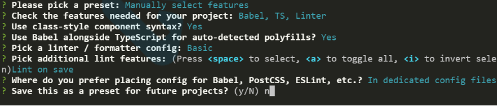

# Web 全栈 vue + ssr + ts 训练营

## **第二章** **vue + ts 训练营**

### 参考

ts website

playground

[Vue Cli + Typescript](https://cn.vuejs.org/v2/guide/typescript.html)


### 知识点

- 安装 TS

  ```javascript
  npm install typescript -g
  ```

- 初始化配置文件 tsconfig.json

  ```
  tsc --init
  ```

- 生成 package.json

  ```
  npm init
  ```

- 工程化

  - 安装相关工具：webpack, webpack-cli, webpack-dev-server

    ```bash
    npm i webpack webpack-cli webpack-dev-server ts-loader typescript html-webpack-plugin
    ```

- VUE + TS 脚手架

  - 新建一个基于 **ts **的 **vue** 项

    

  - 在已存在项目中安装 **typescript**

    ```
    vue add @vue/typescript
    ```

​				请暂时忽略引发的几处 Error，它们不会影响项目运行，我们将在后面处理它们。 

- TypeScript 注意事项：
  - 元组是确定类型的数组。
  - ！表示赋值断言。
  - 不解决完 ts 错误，你休想跑起项目。
  - 类型别名可以用来声明对象用 type 关键字。
  - 带初始值的普通类型，是不需要指定类型的，因为编译器能推断出来。
- PS:
  - TypeScript 戏称为 AnyScript，有时候有些奇怪的问题解决不了，类型只要用 any。
